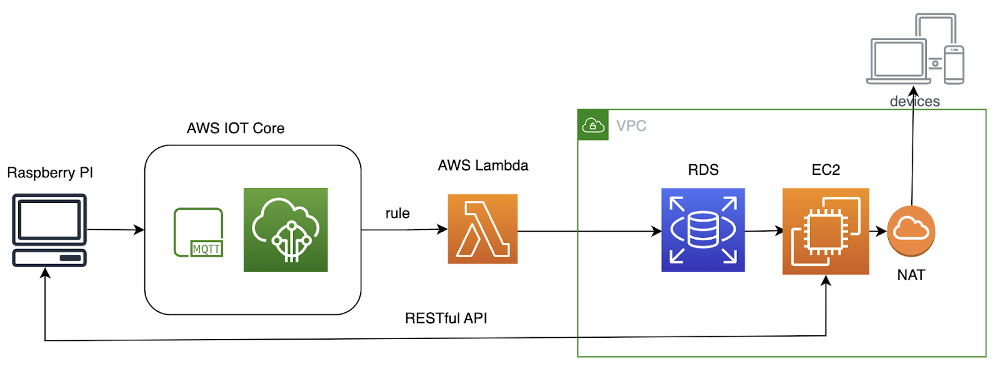
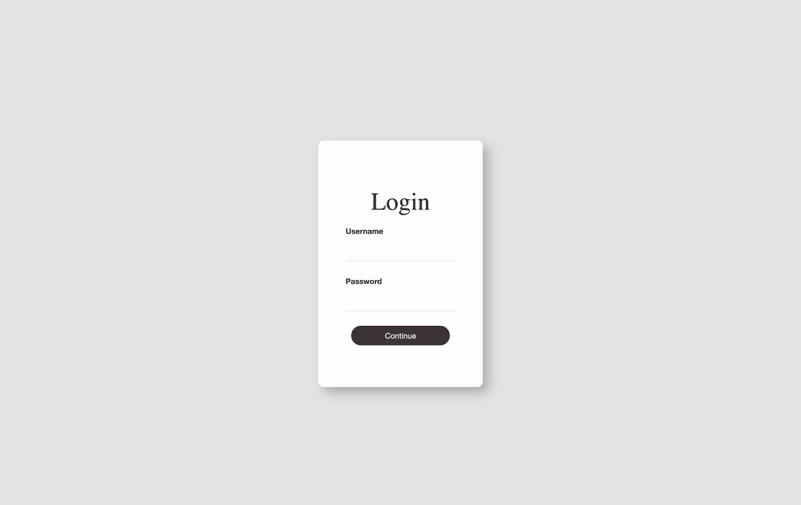
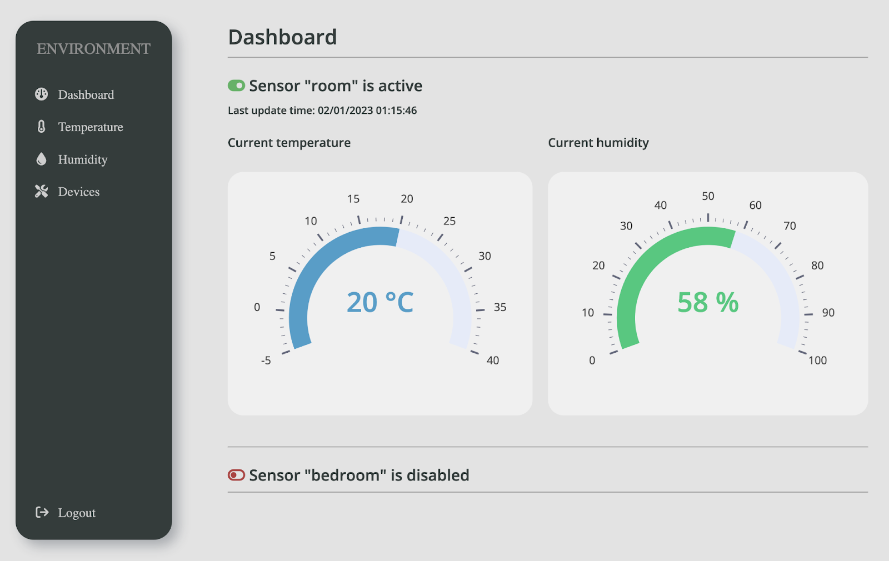
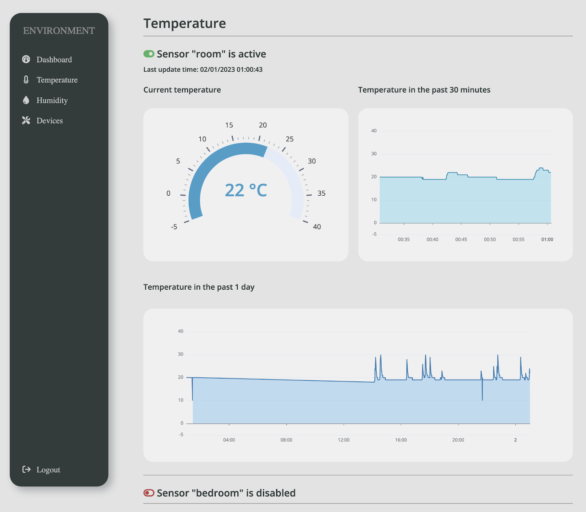
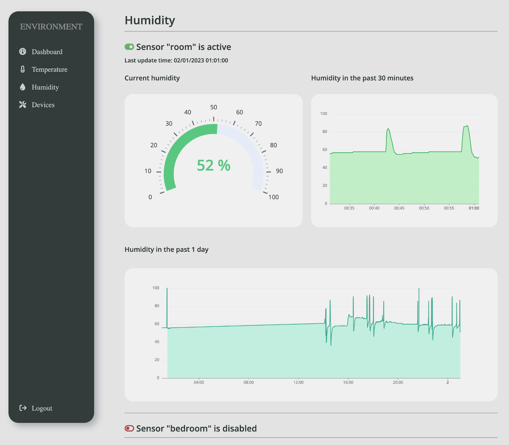
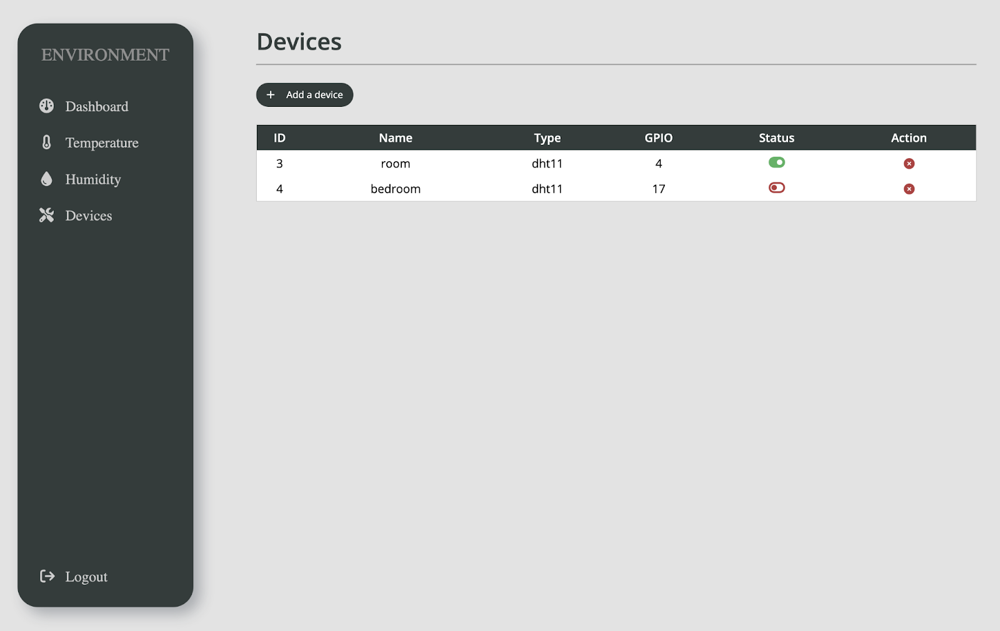
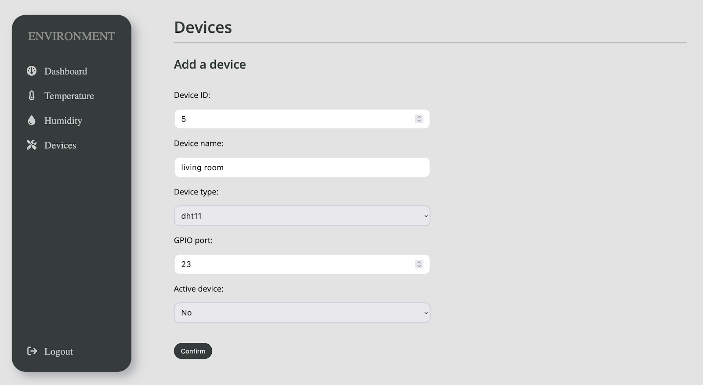

# IoT environment system

> IoT-based environmental monitoring system that tracks temperature and humidity levels in real-time through sensors and presents the data through an intuitive, visual dashboard.

## Features

- Real-time Monitoring: Monitors temperature and humidity levels in real-time using DHT11 digital sensors connected to a Raspberry Pi.
- Visual Dashboard: Presents real-time data through an easy-to-use visual dashboard built with Apache Echarts, allowing users to easily track environmental changes and trends. Users can view data in different time intervals.
- User Management: Supports multiple users with different roles, including administrators and normal users, to restrict authorization of actions based on user permissions.
- Sensor Management: Enables users to add and delete sensors from the application, allowing for greater flexibility in monitoring different environments.
- Cloud-based Storage: Stores data securely in the cloud using AWS IoT Core and RDS, ensuring that data is protected and always accessible. Additionally, the system uses VPC and EC2 to provide a secure and scalable infrastructure for the web application.

## Tech Stack

- 💻 Raspberry Pi: Small, low-cost computer used as an IoT device to collect data from the DHT11 sensor.
- 🌡️ DHT11: Digital sensor that measures temperature and humidity.
- 📡 MQTT: Lightweight messaging protocol that enables the Raspberry Pi to publish sensor data to the AWS IoT Core in real-time.
- 🐍 Python: High-level programming language used for both the Raspberry Pi and Django server development.
- 🕸️ Django: Web framework for Python.
- ☁️ AWS (IoT Core, Lambda, RDS, VPC, EC2): Cloud computing services used to receive, process, store and analyze data collected from the Raspberry Pi and to host the web application.
- 📈 Apache Echarts: Data visualization library for creating graphs and charts to represent environmental data.
- 🛠️ Django REST Framework: Toolkit for building the RESTful API with Django.
- 🌐 Nginx: Web server used to serve the static files for the web application and to proxy requests to the backend server.

## Cloud Architecture

## Application interface

